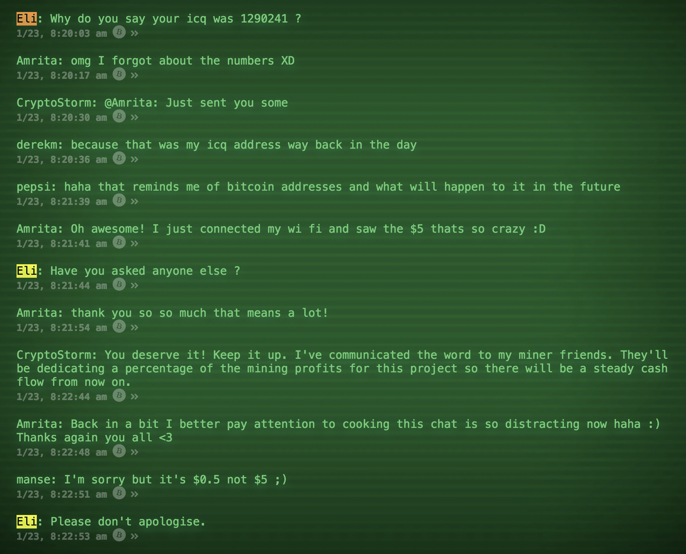
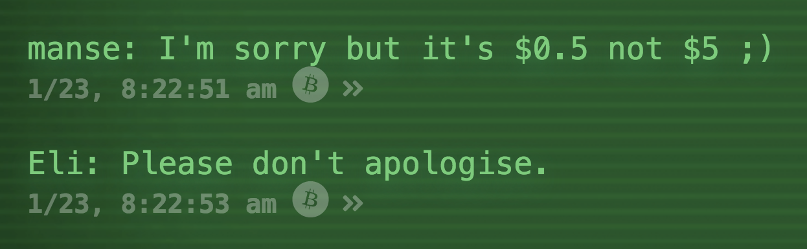
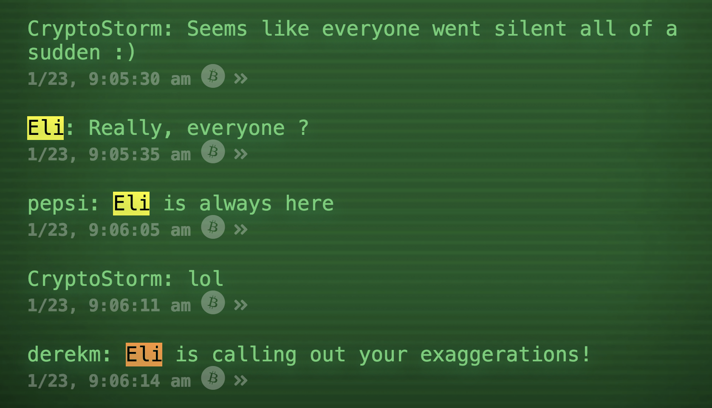

# Eli

---

> Eliza bot on the Bitcoin Blockchain

---



Eli demonstrates how:

Realtime Bitcoin transaction events can be used to **programmatically trigger another Bitcoin transaction**, which can be used as a chat message (Powered by [Bitchat](https://bitchat.bitdb.network)).

**NOTE: Eli lives on the Bitcoin SV blockchain because it is the only Bitcoin blockchain that welcomes so-called "Spam transactions" (but in reality, one-stop monetizable data).**

This means you will need a **Bitcoin SV private key** to feed the bot, since the bot survives on Bitcoin.

Read the following article to learn more about this concept: https://www.yours.org/content/bitsocket--the-realtime-api-for-bitcoin-0c646d55c152

# How Eli Works

Eli:

1. Listen to specific realtime bitcoin transaction patterns
2. Parses the push data
3. Run it through a [Map/Filter function](https://github.com/unwriter/bitpipe#3-bitcoin-lambda)
4. Sign and broadcasts the transaction.

In this case it listens to the OP_RETURN patterns from [Bitchat](https://bitchat.bitdb.network) which looks like this:

```
{
  "v": 3,
  "q": {
    "find": {
      "out.b0": { "op": 106 },
      "out.b1": { "op": 0 }
    }
  },
  "r": {
    "f": "[.[] | { m: .out[0].s2, t: .timestamp, h: .tx.h }]"
  }
}
```

1. Eli listens to this bitquery pattern
2. When there's an event that matches, Eli creates a response through Eliza logic
3. Then turns it into a [Bitchat](https://bitchat.bitdb.network) message as an OP_RETURN transaction
4. Then signs and broadcasts it.

This project uses:

1. [Bitsocket](https://bitsocket.org): Set up a query and listen to realtime incoming Bitcoin events
2. [Bitpipe](https://github.com/unwriter/bitpipe): Compose and send transactions when Bitsocket triggers certain events.
3. [Elizabot](https://www.masswerk.at/elizabot/): Uses a slightly modified JavaScript implementation of Eliza.js by Norbert Landsteiner.


# Demo

You can see it in action at [Bitchat](https://bitchat.bitdb.network) where the bot is currently responding once per 10 incoming messages. 

Feel free to donate to keep the bot going:

[bitcoin:1GnrEMGfSVxEZ96BUtEiGNK3r6hTbQBvTE?sv](bitcoin:1GnrEMGfSVxEZ96BUtEiGNK3r6hTbQBvTE?sv)






# Install

**Step 1. Download**

```
git clone https://github.com/unwriter/Eli.git
```

**Step 2. Install Dependencies**

```
npm install
```

# Usage

Start the Eli (a Bitpipe node):

```
npm start
```

# Build Your Own

Eli is a demo to show how easy it is to build your own Bitcoin bot that:

1. Listens to a specific bitcoin transaction pattern
2. and Trigger another transaction

The main code is `index.js` (The `elizabot.js` is just the bot logic and you can ignore if you're building your own bot logic)
